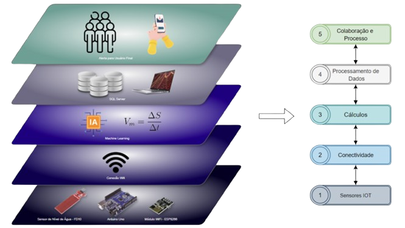

# Projeto IoT para Detecção de Enchentes

## Introdução ao Projeto

Este projeto é um sistema integrado de **Internet das Coisas (IoT)** e **Inteligência Artificial (IA)**, desenvolvido para a **detecção precoce de enchentes**. Enchentes são desastres naturais que resultam em grandes perdas de vidas e bens em diversas regiões do mundo. A proposta deste projeto é criar um sistema que monitore em tempo real o nível de água em rios ou reservatórios e faça previsões sobre o risco de enchente, fornecendo alertas antecipados.

O objetivo do sistema é alertar rapidamente as comunidades e autoridades para que possam tomar medidas preventivas, minimizando danos.

## Funcionamento Geral

O projeto é baseado na integração de dispositivos IoT e algoritmos de IA. Ele utiliza os seguintes componentes:

- **Arduino Uno**: Microcontrolador que processa os dados do sensor de água.
- **Sensor de Água**: Monitora o nível de água em tempo real.
- **Componente de Wi-Fi**: Conecta o Arduino à internet, enviando dados para um servidor ou sistema de IA.
- **Notebook com Software Arduino**: Programado para processar os dados recebidos e rodar os algoritmos de IA.

### Simulação

A simulação ocorre em um ambiente controlado, onde um balde é colocado dentro de uma bacia de água. À medida que a água é adicionada ao balde, o sensor detecta o aumento do nível, e o Arduino transmite esses dados via Wi-Fi para um sistema de IA rodando em um notebook.

A IA analisa a velocidade com que o nível de água sobe e determina se há risco de enchente. Com base nisso, ela alerta o usuário via notificações.

## Fluxo de Informações

1. **Captura de Dados**: O sensor de água monitora continuamente o nível de água e envia as leituras para o Arduino Uno.
2. **Processamento Inicial**: O Arduino realiza pré-processamento básico dos dados, como filtragem de ruídos e calibração.
3. **Transmissão de Dados**: Os dados são enviados via Wi-Fi para um servidor ou sistema de IA.
4. **Análise com IA**: A IA calcula a probabilidade de uma enchente ocorrer e envia os resultados para um banco de dados SQL Server.
5. **Notificação ao Usuário**: Caso o risco de enchente seja detectado, uma notificação é enviada ao usuário (pode ser exibida no notebook ou enviada para um dispositivo móvel).

## Benefícios e Desafios

### Benefícios

- **Aviso Antecipado**: O sistema alerta antes que a enchente ocorra, permitindo a evacuação e medidas preventivas.
- **Automatização e Precisão**: O uso de IoT e IA garante monitoramento contínuo e preciso, sem intervenção humana constante.
- **Escalabilidade**: A tecnologia pode ser aplicada a cenários maiores, como rios grandes ou áreas urbanas.

### Desafios

- **Precisão dos Sensores**: Garantir alta precisão dos sensores, especialmente em condições variáveis.
- **Desempenho da IA**: A IA precisa ser robusta e precisa, o que pode exigir grande volume de dados históricos para treinamento.
- **Conectividade**: O projeto depende de uma conexão Wi-Fi estável, o que pode ser desafiador em áreas remotas.

## Contribuidores

- **Eduardo da Maia Haak**
- **Larissa Hoffmann de Souza**
- **Lukas Thiago Rodrigues**
- **Mateus Akira de Oliveira Muranaka**
- **Matheus Gabriel da Silva**
